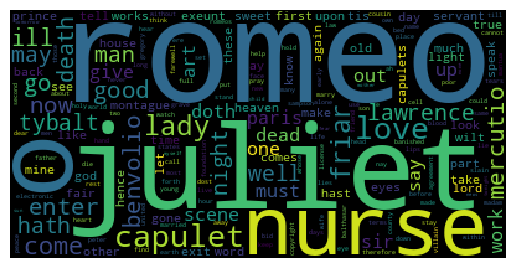
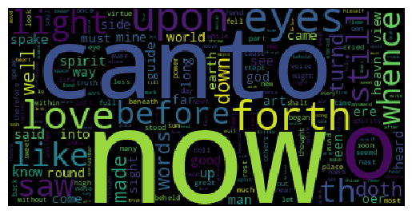
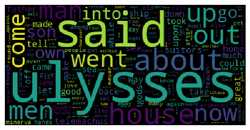

# Word Cloud
A word cloud generator with the most frequent words from plain text books, articles, etc.

Run the Jupyter Notebook from [Google Colab](https://colab.research.google.com).

### Romeo and Juliet by William Shakespeare

### The divine comedy by Dante Alighieri

### The Odyssey by Homer
